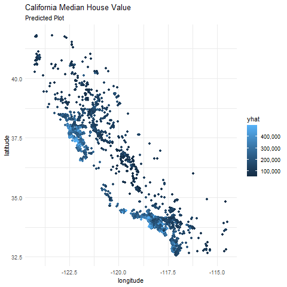
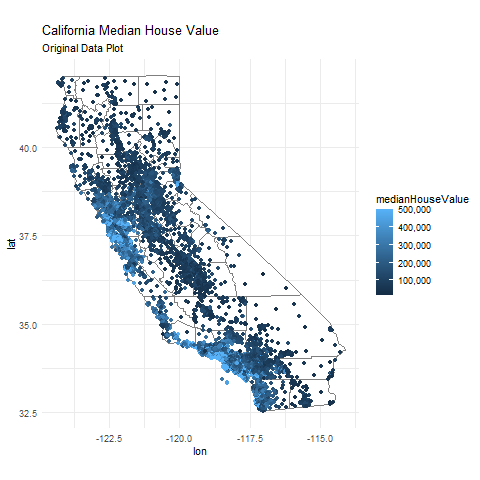

<!--   pdf_document: default
 md_document -->

# 1) What causes what?

## 1-1 Why can’t I just get data from a few different cities and run the regression of “Crime” on “Police” to understand how more cops in the streets affect crime? (“Crime” refers to some measure of crime rate and “Police” measures the number of cops in a city.)

Because we can’t understand the causal effect between crime and police.
At first we learn as the podcast said and also according to the author
of the book that there could be a way of establishing a causal
relationship between - at least in Washington, D.C.A lot of extra police
officers are hired even if the crime rate is low because of some
terrorism alert. Now, when you have extra police there for
terrorism-related reasons, they’re on the streets, they make the streets
safer, and things like murder, robbery, assault go down as in there was
less victimes on the street. But when this hypothesis was checked by
looking at ridership levels on the Metro system, and they actually were
not diminished on high-terror days, so it was suggested and confirmed
that the number of victims was largely unchanged. Therefore, if we
regress crime on police from a few different cities like D.C., we will
probably misunderstand the effect as it’s tough to establish the
causality. So, we can’t do this.

## 1-2 How were the researchers from UPenn able to isolate this effect? Briefly describe their approach and discuss their result in the “Table 2” below, from the researchers’ paper.

They found that when the terror alert level goes up, extra police are
put on the mall in other parts of Washington to protect against
terrorists has nothing to do with street crime. Also then, the streets
were safer(the number of murder, robbery, assault goes down).

To show this causality, they regressed the crime on the High Alert, and
got the result of the Table 2, i.e. one unit increase in high alert
causes the crime rate to go down by 7.316 unit. This background of the
regression is as follow:

At first, they thought this structure, where the outcome *y* is crime, a
variable that want to show the causality *x*, and a instrument variable
*z* is the High Alert.

Because of the endogeneity, they cannot direct regress *y* on *x*, but
they selected the High Alert as an instrument, *z* that is positive
correlated with *x*. And then they used regress *y* on *z* with reduced
form like:

$$
\begin{aligned}
y\_{crime}=\gamma\_0+\gamma\_1z\_{\\{High\\ Alert\\}}+\varepsilon
\end{aligned}
$$

where *β*1*π*1 and
*x**p**o**l**i**c**e* = *π*0 + *π*1*z*{*H**i**g**h* *A**l**e**r**t*} + *v*.
Since the *x* and *z* are positive correlated, the coefficient of the
High Alert on Table 2 shows *β*1 &lt; 0. This means that on
the high-alert days, total crimes decrease by an average of seven crimes
per day, or approximately 6.6 percent. Also, it means that the more
police causes the less crime.

## 1-3 Why did they have to control for Metro ridership? What was that trying to capture?

According to their talks, they concerned about the possibility that
tourist were less likely to visit Washington D.C. if the High Alert was
announced, and what tourist were less likely to visit caused less crime.
To check this hypothesis, they added a variable of the scaled Metro
Ridership into the regression model.

And then, they found that the coefficient of the High Alert is still
negative even if they added its variable. Therefore, they concluded that
the number of victims was largely unchanged. Thus we will probably
misunderstand the effect as it’s tough to establish the causality.

### 1-4 Below I am showing you “Table 4” from the researchers’ paper. Just focus on the first column of the table. Can you describe the model being estimated here? What is the conclusion?

This model is Difference In Difference model, which control group is
other district and treatment group is District 1.

Firstly, a clustering approach has been used to cluster by district. And
then, the difference between the High Alert × District One and the High
Alert × Other Districts coefficients represents the effect of District 1
on the crime under the setting that controls for all common factors
between the districts. The most of the increased police attention falls
on District 1 because of the presence in that district of the White
House, Congress, Supreme Court, and so forth. It is revealing to take
this argument one step further and assume that all of the increased
protection falls on District 1. In this case, the difference between the
High Alert \# District One and the High Alert \# Other Districts
coefficients is a difference- in-difference estimator that controls for
all common factors between the districts. The difference-in-difference
estimator controls for any factors such as weather, tourism, or other
events that affect the districts similarly. Even after controlling for
all such factors and recognizing that our assumption is too strong, we
still find that crime decreases in District 1 during high-alert periods
by some two crimes per day or more than 12 percent.

# 2) Tree modeling:dengue cases

## 1. Overview

-   Our goal is to use CART, random forests, and gradient-boosted trees
    to predict dengue cases. From the best predictive model, we need to
    make three partial dependence plots on specific\_humidity,
    precipitation\_amt & one variable of our choice.

## 2. Data and Model

### 2-1 Data

-   dengue.csv
-   The detailed explanations of each variables are in the prompt We did
    not take logarithm of the total cases because we dont need to scale
    the number of dengue cases. The cases of dengue range from 0 to 329.
    We can not take logarithm of 0. So it does not make sense to take
    logarithm of the cases. Note: we did not take log for total cases
    because we thought total cases did not look like it had any trend
    term as follows:

### 2-2 Model

We took CART, random forests, and gradient-boosted trees to predict
dengue cases as follow:

$$
\begin{aligned}
total\\ cases = city + season + specific\\ humidity+tdtr\\ k+precipitation\\ amt
\end{aligned}
$$
\## 3. Results We have used CART, random forests, and gradient-boosted
tree models to predict the dengue cases below.

From the result, these rmse of there models are

<table>
<thead>
<tr class="header">
<th style="text-align: right;">cart</th>
<th style="text-align: right;">forest</th>
<th style="text-align: right;">boost</th>
</tr>
</thead>
<tbody>
<tr class="odd">
<td style="text-align: right;">24.83</td>
<td style="text-align: right;">22.42</td>
<td style="text-align: right;">18.53</td>
</tr>
</tbody>
</table>

Based on the out of sample RMSE, the Gaussian Booster model seems to
have the best prediction power.

**Now we plot the partial dependence of 4 variables.**

The graphs above show the partial dependence (marginal effects) of the
chosen variables on total cases of dengue based on the Gaussian boosting
model.From the partial dependence plot, we see that the specific
humidity shows an interesting pattern on predicted dengue cases. When
humidity level is more than 15 gram of water per kg of air, the humidity
level increases the dengue cases.From 18 gram to 19 gram of humidity
level, the dengue cases increases exponentially with the level of
humidity. However, the dengue cases slows down and plateau after 20 gram
level. Dengue cases shows fluctuating pattern with respect to the Amount
of rainfall per week. The dengue cases reach peak when rainfall is at 75
milimeters. At a rainfall level more than 200 milimeter, the dengue
cases plateau. The dengue cases are severe during the Fall season and
least severe during spring season.

Finally, between the two cities, the dengue cases are more prevalent in
San Juan, puerto rico.

I have included all 4 variables since all of them seems interesting,
especially with the high difference between the two cities, and the Fall
season with the other seasons.

\##Conclusion For predicting dengue cases, we have found that the best
model is gradient boosted tree. This model outperforms both the CART &
random forest models as the rmse is the minimum for this model among all
other models. Using the gradient-boosted model we evaluated the partial
dependence/marginal effects of
‘specific\_humidity’,‘precipitation\_amt’,‘season’ and ‘city’ on dengue
cases. We saw that at humidity levels between 18 gram & 19 gram of water
per kg air, the dengue cases increase exponentially with humidity.
Moreover, Dengue cases show fluctuating pattern with respect to the
Amount of rainfall per week. The effect of rainfall on Dangue disease is
maximum at 75 milimeters of rainfall level but the Dengue cases plateau
at a rainfall level more than 200 milimeter. The partial dependence plot
also shows that The dengue cases are severe during the Fall season and
least severe during spring season.Finally, of the two cities the dengue
desease is more prevalent in San Juan, puerto rico.

# 3) Predictive model building: green certification

## 1. Overview

The goal of this exercise is predict the revenue per square foot per
calender year of about 8,000 commercial rental properties across the US.
In addition, some of those properties are green certified which means
they got green certification from either LEED or Energystar. Another
question we want to answer is whether being green certified will raise
total rental revenue or not.

## 2. Data and Model

### 2-1 Data

-   We have used the dataset of Green buildings in greenbuildings.csv
    (7894 commercial rental properties from across United States)
-   Of these, 685 properties have been awarded either LEED or EnergyStar
    certification as a green building
-   In this model “revenue per square foot per claendar year”(RPS), will
    be dependent variable, which is the product of rent and
    leasing\_rate in the data.

### 2-2 Methods

First of all, we have mutated a new column to calculate the revenue per
square foot per calender year based on the original data. In order to do
that, we took the product of rent and leasing\_rate. We need to do that
to get unbiased prediction results since the occupancy or the rent\_rate
alone won’t reflect the revenue.Here, “revenue per square foot per
claendar year”(RPS), will be our dependent variable. We have excluded
CS\_PropertyID variable as this is nothing but an ID number for the
buildings. We have also excluded Rent & Lease rate from the list of
independent variables as we used these two variables to find my
dependent variable of ““revenue per square foot per claendar year”(RPS).
We collapsed LEED & EnergyStar into ‘Green.rating’ variable.

Next, We needed to make sure that some of the variables are dummy
variables, so we used the factor command on the 0/1 variables. Then, we
started working on the model by splitting the data to training set (80%)
and testing set (20%). We trained the data to predict revenue using
random forest model & gradient boosting model.

We used three random forest models, and one gradient boosting model to
measure the efficiency of the predictions.

### 2-2-1 Model Selection

We have used total 4 models.In my base model & in all other 3 models, my
dependend variable is “revenue per square foot per calender year”

We have used a random forest model with all variables as our base model.
We have already excluded Rent, Lease Rate, CS\_PropertyID , LEED &
Energystar variables because of the reasons mentioned above. So, after
our base model, the 2nd model is also a random forest including 6
variables (City\_Market\_Rent , Electricity\_Costs , size , stories ,
age & green\_rating) with different importance level for each one of
them. The 3rd random forest model had 9 variables with many more less
important variables(City\_Market\_Rent , Electricity\_Costs , size ,
stories , age , green\_rating,hd\_total07 , total\_dd\_07 &
total\_dd\_07) . I worried that it is going to overfit the model, so now
we got to check the rmse for each one of them and compare it with what
we got in the base model. since we are looking for the best predictive
model, it is going to be worth it to try to model using gradient
boosting model with all variables. Here we have used k fold cross
validation for each model.

## 3. Results

Now let’s move on the methodology used to predict the revenue. At first,
We have defined the variables& go for train & test split.

Now we use 3 different random forest models & 1 gradient boost model for
prediction.

    ## Distribution not specified, assuming gaussian ...
    ## Distribution not specified, assuming gaussian ...
    ## Distribution not specified, assuming gaussian ...
    ## Distribution not specified, assuming gaussian ...
    ## Distribution not specified, assuming gaussian ...

From the results, we got the rmse of 3 random forest & 1 Boost model. It
shows that the minimum RMSE is obtained from Random Forest model 2.

<table>
<thead>
<tr class="header">
<th style="text-align: right;">rmse_forest_cv1</th>
<th style="text-align: right;">rmse_forest_cv2</th>
<th style="text-align: right;">rmse_forest_cv3</th>
<th style="text-align: right;">rmse_boost_cv4</th>
</tr>
</thead>
<tbody>
<tr class="odd">
<td style="text-align: right;">499.65</td>
<td style="text-align: right;">493.18</td>
<td style="text-align: right;">588.5868</td>
<td style="text-align: right;">924.77</td>
</tr>
</tbody>
</table>

We got partial dependence for ‘green rating’ below of the random forest
model 2 that had the lowest rmse to interpret our model.

    ##   green_rating     yhat
    ## 1            0 2398.914
    ## 2            1 2513.602

 The
partial dependence graph shows that the green certified buildings
generate greater rental income per square foot.

# \# Conclusion:

Using 4 different predictive modelswith K crossfold validation method ,
we observe that the 2nd Random Forest model with 6 independent
variables( City\_Market\_Rent, Electricity\_Costs , size , stories , age
& green\_rating ) outperformed the other 3 models as it had the best
predictive power with minimum RMSE value of 493.18. So We would
recommend to use the 2nd Random Forest model with 6 important
independent variables to predict the revenue per squared foot per
calender year. We predicted the average value for both certified and
certified, and as we can see, the green certification has higher partial
effects i.e such certifications brings more predicted revenue for the
housing properties. So, Green certification is very important for
generating superior rental income for the property owners.

## Problem 4

## Predictive model building: California housing

## 1. Overview

-   My goal is to build the best predictive model you can for
    medianHouseValue

## 2. Data and Model

### 2-1 Data

-   CAhousing.csv

### 2-2 Model

We took 3 steps to get the best predictive model as follow: we have used
machine learning tools to provide with reliable predictions. So, we have
used the random forest model, which utilizes the interaction effects of
the variables. 1. I mutated to new columns to standardized the total
rooms and total bedrooms by dividing each variable by households
variable. Then, I split the data into 80% training set and 20% testing
set and regress medianHousevalue on all the variables to test for the
importance of each variables afterward. 2. we did two other
specification models with different variables based on the results of
the variables importance.

$$
\begin{aligned}
Model1:\quad medianHouseValue&= \beta\[all\\ data+const.\]\\\\
Model2:\quad medianHouseValue&= \beta\[ medianIncome + longitude + latitude + totalRooms\_{st}+const.\] \\\\
Model3:\quad medianHouseValue&= \beta\[ medianIncome + longitude + latitude + totalRooms\_{st} + population + housingMedianAge+const.\] \\\\
\end{aligned}
$$

-   totalRooms\_st = totalRooms/households

1.  model has the lowest root mean squared error which equals to 47,989.
    In order to check for room of improvements, we ran a gradient
    boosting model with many different shrinkage rates, but we could not
    have a lower rmse value than that found using the selected random
    forest model.
2.  Plot we decided to continue with the results of the optimal random
    forest model and predict the median housing values based on the
    testing set. Then we plottod the original observation which has the
    shape of California State, the predicted values based on the testing
    set, and the estimated residuals which is the difference between the
    two.

### 3. Results

The overall out-of-sample accuracy of our proposed model is

<table>
<thead>
<tr class="header">
<th style="text-align: right;">CA_RFM1_rmse</th>
<th style="text-align: right;">CA_RFM2_rmse</th>
<th style="text-align: right;">CA_RFM3_rmse</th>
<th style="text-align: right;">CA_Boost_rmse</th>
</tr>
</thead>
<tbody>
<tr class="odd">
<td style="text-align: right;">48630.96</td>
<td style="text-align: right;">48572.76</td>
<td style="text-align: right;">47998.16</td>
<td style="text-align: right;">51663.24</td>
</tr>
</tbody>
</table>

Three figures(row) that required to be plotted (1)a plot of the original
data, (2)a plot of your model’s predictions of medianHouseValue, (3)a
plot of your model’s errors/residuals are:

Also, these fugures in the real california map are

### 4. Conclusion

From the result, median House value in the area of San Francisco bay
area and Los Angels are higher than other areas in the real data and
predicted data. Also, the area of lower median house value in the
prediction looks like the same as that in the real. Therefore, our
prediction model shows good performance visually to predict median house
values.
